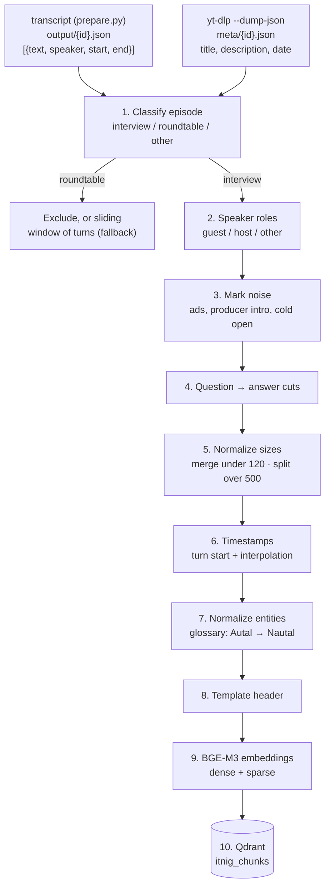

# Deterministic ingestion (no LLM)

> **Status: design only, not implemented.** This is the rule-based alternative that
> the [LLM ingestion](llm-ingestion.md) falls back to when an episode's LLM response
> fails validation twice. It was also the baseline the LLM approach was compared
> against.

Turns each transcript (`output/<id>.json`) into question → answer chunks using only
Python rules: who is speaking, where there is a question and how many words the chunk
holds. It is free, bit-for-bit reproducible and debuggable, but it depends entirely on
diarization. When diarization fails, it produces micro-chunks on follow-up questions or
blocks several minutes long with no cut (Wallbox, 07:54–15:53: 1,404 words in a single
chunk).

## Diagram



## Steps

### 1. Classify the episode

- **Input:** turns and metadata. The transcript does not store the title or the
  description, so they are fetched separately with `yt-dlp --dump-json <url>`
  (`meta/{id}.json`), as in `transcripts/selection.json`.
- **Rules, in this order:**
  1. The title contains `Tertulia` (roundtable) → `tertulia`.
  2. The main speaker holds more than 70 % of the words → `entrevista` (interview).
  3. Anything else → `otro` (other).
- **Output:** `episode_type`. Roundtables have no question → answer structure: they are
  excluded or processed with a ~300-word window of turns with a one-turn overlap.

### 2. Assign speaker roles

- **Guest:** the speaker with the most words.
- **Host:** the speaker with the second most words.
- **Other:** any speaker with less than 2 % of the words (voice-over, ads, diarization
  errors).
- **Names, only if a regex finds them:**
  - Guest and company, in titles like `con <Name> de <Company>` (*with <Name> from
    <Company>*).
  - Host, in self-introductions like `Yo soy <Name> <Surname>` (*I am …*) in the first
    2 minutes, checked against a fixed list of known hosts (Bernat Farrero…).
  - With no match, `name: null`.
- **Limit:** without an LLM, name resolution is partial. In interviews with several
  guests or unusual titles it stays empty.

### 3. Mark the noise

Noise is marked with `is_boilerplate: true` instead of being deleted:

- **Ads:** turns in the first 2 minutes containing `patrocina` (*sponsors*),
  `Descubre más en` (*find out more at*) or a domain (`\w+\.com`).
- **Producer intro:** opening turns by a speaker with role `other`. In Wallbox it runs
  from 0 to 148 s and summarizes the episode, so it would duplicate search results.
- **Cold open:** turns in the first 90 s whose text reappears later (Jaccard similarity
  over 5-word shingles > 0.6). The later occurrence, which has context, is kept.

### 4. Cut by question → answer

- A new chunk starts when three conditions hold:
  - someone other than the guest is speaking,
  - the turn contains `?` and has 6 words or more,
  - the current chunk already contains a guest turn.
- The host's short interjections (`¿Ah, sí?`, `Pitch complicado, ¿eh?`) stay inside
  the current chunk.
- **Limit:** questions that diarization put inside the guest's turn do not trigger a
  cut (Nautal, 07:15: "¿Y cómo es la evolución?"). Neither do prompts without a question
  mark ("Para explicarlo para tontos, vosotros hacéis el enchufe" — *"to put it simply,
  you make the plug"*).

### 5. Normalize sizes

- **Merge:** a chunk under 120 words is merged into the previous one if both belong to
  the same guest answer. This fixes chained follow-up questions; in Nautal, from 01:54
  to 03:21, four chunks of 33 to 112 words came out for a single story.
- **Split:** a chunk over 500 words is split by sentences into ~300-word pieces with a
  1–2 sentence overlap. The original question is repeated as a header on each piece.
- **Limit:** the cut is by size, not by topic. A monologue that changes topic halfway
  gets split at an arbitrary point.

### 6. Compute the timestamps

- The chunk's `start` and `end` are those of its first and last turns.
- For pieces that start inside a turn, the time is linearly interpolated by character
  position: `turn_start + (offset / len(text)) × duration`. The measured pace is ~2.8
  words/s and the typical error ±10–20 s.
- The link is built as `https://www.youtube.com/watch?v=<id>&t=<start − 3>s`, so it does
  not start mid-sentence.

### 7. Normalize entities

- The glossary has two sources:
  - Fixed: `ITNIC`, `Indy`, `Itnic` → `Itnig`.
  - Per episode: person and company names from the title and the description, matched
    with variants in the text by edit distance (`Autal` → `Nautal`,
    `Octavio Ullá` → `Octavi Uyà`).
- It is applied to `text_embed`. `text_display` keeps the original transcript.

### 8. Add the template header

A header built from metadata only is prepended to the text that gets embedded:

```
{title} ({year}). {guest name or "Invitado"}, {company}.
Pregunta: {the host's first question in the chunk}
```

### 9. Compute the embeddings

- **Model:** BGE-M3, locally. It accepts up to 8,192 tokens (a 500-word chunk is about
  700) and produces dense and sparse vectors in a single pass.
- **Input:** `header + text_embed`.

### 10. Load into Qdrant

- **Collection:** `itnig_chunks`, with the named vectors `dense` and `sparse`.
- **Deterministic ID:** `uuid5(video_id + start)`. Re-ingesting an episode overwrites
  its chunks instead of duplicating them.
- **Payload:**

```json
{
  "video_id": "yOLw6ncCJwY",
  "episode_title": "Alquiler de barcos con Octavi Uyà de Nautal - Podcast 121",
  "episode_type": "entrevista",
  "published": "2020-01-07",
  "start": 435.2,
  "end": 525.9,
  "url": "https://www.youtube.com/watch?v=yOLw6ncCJwY&t=432s",
  "speakers": [
    {"label": "SPEAKER_01", "name": "Octavi Uyà", "role": "invitado", "company": "Nautal", "share": 0.86},
    {"label": "SPEAKER_02", "name": "Bernat Farrero", "role": "anfitrión", "company": "Itnig", "share": 0.14}
  ],
  "question": "¿Y cómo es la evolución? ¿Cómo empieza?",
  "text_display": "Octavi Uyà (Nautal): Sí, sí, fue el primero...",
  "text_embed": "...",
  "is_boilerplate": false,
  "prev_id": "…",
  "next_id": "…",
  "segmenter": "deterministic",
  "pipeline_version": "det-1"
}
```
