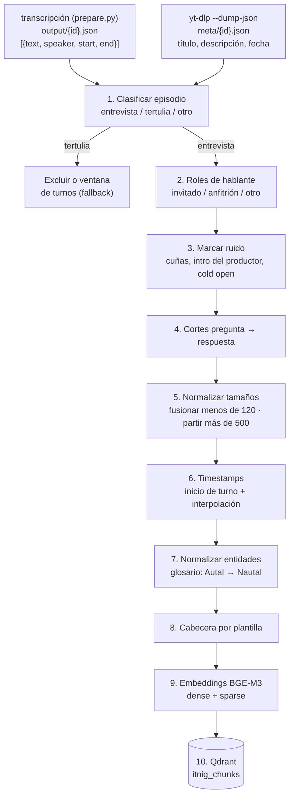

# Ingesta determinista (sin LLM)

Convierte cada transcripción (`output/<id>.json`) en chunks de pregunta → respuesta usando solo reglas en Python: quién habla, dónde hay una pregunta y cuántas palabras lleva el chunk.
Es gratis, reproducible bit a bit y depurable, pero depende por completo de la diarización. Cuando falla, produce micro-chunks en las repreguntas o bloques de varios minutos sin corte (Wallbox, 07:54–15:53: 1.404 palabras en un solo chunk).

## Diagrama



## Pasos

### 1. Clasificar el episodio

- **Entrada:** turnos y metadatos. La transcripción no guarda título ni descripción, así que se obtienen aparte con `yt-dlp --dump-json <url>` (`meta/{id}.json`), igual que en `guiones/seleccion.json`.
- **Reglas, en este orden:**
  1. El título contiene `Tertulia` → `tertulia`.
  2. El hablante principal supera el 70 % de las palabras → `entrevista`.
  3. En cualquier otro caso → `otro`.
- **Salida:** `episode_type`. Las tertulias no tienen estructura pregunta → respuesta: se excluyen o se procesan con una ventana de turnos de ~300 palabras con un turno de solape.

### 2. Asignar roles de hablante

- **Invitado:** el hablante con más palabras.
- **Anfitrión:** el segundo hablante con más palabras.
- **Otro:** cualquier hablante con menos del 2 % de las palabras (voz en off, cuñas, errores de diarización).
- **Nombres, solo si una regex los encuentra:**
  - Invitado y empresa, en títulos del tipo `con <Nombre> de <Empresa>`.
  - Anfitrión, en autopresentaciones del tipo `Yo soy <Nombre> <Apellido>` en los primeros 2 minutos, contrastadas con una lista fija de anfitriones conocidos (Bernat Farrero…).
  - Si no hay coincidencia, `name: null`.
- **Límite:** sin LLM, la resolución de nombres es parcial. En entrevistas con varios invitados o títulos atípicos quedará vacía.

### 3. Marcar el ruido

El ruido se marca con `is_boilerplate: true` en lugar de borrarse:

- **Cuñas:** turnos de los primeros 2 minutos que contienen `patrocina`, `Descubre más en` o un dominio (`\w+\.com`).
- **Intro del productor:** turnos iniciales de un hablante con rol `otro`. En Wallbox ocupa de 0 a 148 s y resume el episodio, con lo que duplicaría resultados en la búsqueda.
- **Cold open:** turnos de los primeros 90 s cuyo texto reaparece más adelante (similitud de Jaccard sobre shingles de 5 palabras > 0,6). Se conserva la aparición posterior, que tiene contexto.

### 4. Cortar por pregunta → respuesta

- Se abre un chunk nuevo cuando se cumplen tres condiciones:
  - habla alguien que no es el invitado,
  - el turno contiene `?` y tiene 6 palabras o más,
  - el chunk actual ya contiene algún turno del invitado.
- Las interjecciones cortas del anfitrión (`¿Ah, sí?`, `Pitch complicado, ¿eh?`) quedan dentro del chunk en curso.
- **Límite:** las preguntas que la diarización metió en el turno del invitado no generan corte (en Nautal, 07:15: "¿Y cómo es la evolución?"). Tampoco los encargos sin interrogación ("Para explicarlo para tontos, vosotros hacéis el enchufe").

### 5. Normalizar tamaños

- **Fusionar:** un chunk de menos de 120 palabras se une al anterior si ambos pertenecen a la misma respuesta del invitado. Corrige las repreguntas encadenadas; en Nautal, de 01:54 a 03:21 salían cuatro chunks de entre 33 y 112 palabras para una sola historia.
- **Partir:** un chunk de más de 500 palabras se divide por frases en trozos de ~300, con 1–2 frases de solape. La pregunta original se repite como cabecera en cada trozo.
- **Límite:** el corte es por tamaño, no por tema. Un monólogo que cambia de tema a mitad queda partido por un sitio arbitrario.

### 6. Calcular los timestamps

- `start` y `end` del chunk son los del primer y el último turno.
- En trozos que empiezan dentro de un turno, se interpola linealmente por posición de carácter: `start_turno + (offset / len(texto)) × duración`. El ritmo medido es de ~2,8 palabras/s y el error típico, de ±10–20 s.
- El enlace se genera como `https://www.youtube.com/watch?v=<id>&t=<start − 3>s`, para no entrar a mitad de frase.

### 7. Normalizar entidades

- El glosario se construye de dos fuentes:
  - Fija: `ITNIC`, `Indy`, `Itnic` → `Itnig`.
  - Por episodio: nombres de persona y empresa sacados del título y la descripción, emparejados con variantes del texto por distancia de edición (`Autal` → `Nautal`, `Octavio Ullá` → `Octavi Uyà`).
- Se aplica a `text_embed`. `text_display` conserva la transcripción original.

### 8. Añadir la cabecera por plantilla

Se antepone al texto que se embebe una cabecera generada solo con metadatos:

```
{título} ({año}). {nombre invitado o "Invitado"}, {empresa}.
Pregunta: {primera pregunta del anfitrión en el chunk}
```

### 9. Calcular los embeddings

- **Modelo:** BGE-M3 en local. Admite hasta 8.192 tokens (un chunk de 500 palabras son ~700) y da vector denso y sparse en una sola pasada.
- **Entrada:** `cabecera + text_embed`.

### 10. Cargar en Qdrant

- **Colección:** `itnig_chunks`, con los vectores con nombre `dense` y `sparse`.
- **ID determinista:** `uuid5(video_id + start)`. Reingerir un episodio sobrescribe sus chunks y no los duplica.
- **Payload:**

```json
{
  "video_id": "yOLw6ncCJwY",
  "episode_title": "Alquiler de barcos con Octavi Uyà de Nautal - Podcast 121",
  "episode_type": "entrevista",
  "published": "2020-01-07",
  "start": 435.2,
  "end": 525.9,
  "url": "https://www.youtube.com/watch?v=yOLw6ncCJwY&t=432s",
  "speakers": [
    {"label": "SPEAKER_01", "name": "Octavi Uyà", "role": "invitado", "company": "Nautal", "share": 0.86},
    {"label": "SPEAKER_02", "name": "Bernat Farrero", "role": "anfitrión", "company": "Itnig", "share": 0.14}
  ],
  "question": "¿Y cómo es la evolución? ¿Cómo empieza?",
  "text_display": "Octavi Uyà (Nautal): Sí, sí, fue el primero...",
  "text_embed": "...",
  "is_boilerplate": false,
  "prev_id": "…",
  "next_id": "…",
  "segmenter": "deterministic",
  "pipeline_version": "det-1"
}
```
