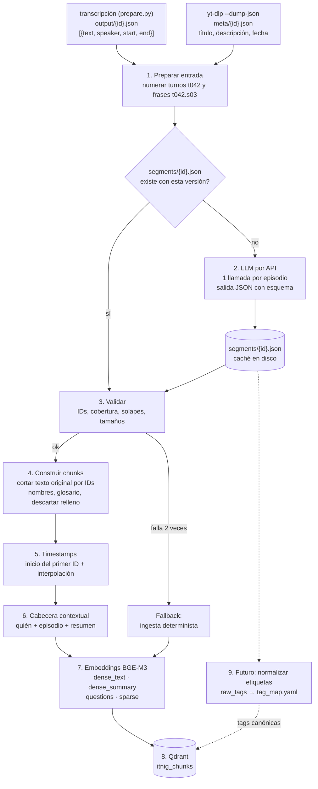

# Ingesta con LLM

Un LLM lee cada episodio completo una vez y devuelve dónde cortar (solo IDs de turno o frase, nunca texto), quién es cada hablante y metadatos de cada unidad: tipo, resumen, etiquetas temáticas libres y preguntas que responde.
Los chunks se cortan siempre del texto original. Si la respuesta del LLM no pasa la validación, ese episodio cae al pipeline determinista ([ingesta-determinista.md](ingesta-determinista.md)).

## Diagrama



## Pasos

### 1. Preparar la entrada

- **Cabecera:** título, fecha y descripción del vídeo, obtenidos con `yt-dlp --dump-json` (`meta/{id}.json`), porque la transcripción no los guarda.
- **Numeración:** cada turno recibe un ID con su timestamp y su etiqueta de hablante:
  ```
  [t020 00:07:15 SPEAKER_01] Sí, sí, claro. Como digo, está fragmentado...
  ```
- **Turnos largos:** los de más de 150 palabras se parten en frases (regex de fin de frase sobre `.`, `?`, `!`) con IDs `t020.s1`, `t020.s2`… Así el LLM puede cortar dentro de un monólogo como el de Wallbox, de 986 palabras.
  - **Por qué:** el LLM solo puede cortar donde hay un ID. Si la unidad mínima es el turno, un turno es indivisible. En la muestra, solo el 10 % de los turnos supera las 150 palabras (179 de 1.742), pero concentran el **46 % de las palabras**: casi la mitad del contenido son monólogos, y ahí es donde el invitado cuenta sus historias.
  - **Qué se pierde sin IDs de frase:**
    - Un monólogo con varios temas se embebe en un solo vector. En Wallbox serían renovables, *vehicle-to-grid* y patrones de consumo: el vector promedia los tres y no se parece mucho a ninguno, así que una consulta sobre cualquiera de ellos lo encuentra peor.
    - El tope de 600 palabras por unidad del paso 3 no se podría cumplir.
    - No se podrían separar las preguntas mal atribuidas, como "¿Y cómo es la evolución?" dentro del turno de Octavi en Nautal (`t020.s4`).
  - **Por qué 150 palabras:** los turnos cortos se quedan como una sola pieza, porque en menos de un minuto rara vez cambia el tema. Así la entrada lleva menos IDs (menos tokens y menos opciones donde equivocarse), y el 46 % del texto que está en monólogos sigue pudiéndose cortar.
  - **Si la regex se equivoca** (por ejemplo, al partir "S.A." o "3.5"), no hace daño: solo añade un punto de corte que el LLM no usará. Las frases son candidatas a corte, no cortes.
- **Tamaño:** un episodio ocupa entre 12.000 y 22.000 tokens de entrada, así que cabe entero en una sola llamada.

### 2. Llamar al LLM (una vez por episodio)

- **Salida estructurada con esquema JSON** (*tool use* o *structured outputs* del proveedor), a temperatura 0.
- **Qué pide el prompt:**
  - `speakers`: el mapa `SPEAKER_XX → {name, role, company}`, deducido de las presentaciones, el título y la descripción.
  - `units`: rangos contiguos `{from, to}` de IDs que cubren todo el episodio sin solaparse. Cada unidad cuenta una sola cosa (una anécdota, un consejo, una explicación) y se entiende sola.
  - Por cada unidad:
    - `type`: `anecdota | consejo | opinion | dato | relleno`
    - `title`
    - `summary` (1–2 frases, con nombres propios)
    - `raw_tags` (0–4 etiquetas libres): el problema de negocio del que trata la unidad, como `primeros clientes`, `pivote` o `financiación`. Las reglas del prompt:
      - Genéricas, reutilizables en cualquier empresa y sector. Nunca un sector, producto, empresa, persona o lugar del episodio: en Nautal, `primeros clientes` ✓ y `barcos` ✗; en Wallbox, `vehículo eléctrico` ✗. Una tecnología solo vale si es el tema en sí y atraviesa empresas (`inteligencia artificial`).
      - En castellano, en minúsculas, de 1 a 3 palabras.
      - El nombre más llano posible: `primeros clientes`, no `early adopters`, `tracción inicial` ni `go-to-market`.
      - Las unidades de relleno van sin etiquetas.
    - `questions` (2–4 preguntas que responde, redactadas como las haría un usuario)
  - `glossary`: correcciones de nombres mal transcritos (`Autal → Nautal`, `Citrocket → Seedrocket`).
  - `episode_summary`: resumen del episodio en 3–5 frases.
- **Caché:** la respuesta se guarda en `segments/<id>.json` junto con `model` y `prompt_version`. Si ya existe con la misma versión, no se vuelve a llamar. Cambiar el prompt invalida la caché de forma explícita. Las etiquetas no forman parte de la clave de caché: cambiar cómo se normalizan (paso 9) no obliga a volver a segmentar.

### 3. Validar la respuesta

Todas estas comprobaciones son deterministas:

- Todos los IDs existen y cada `from` va antes de su `to`.
- Cobertura completa: cada turno o frase pertenece a exactamente una unidad.
- Tamaño de cada unidad entre 80 y 600 palabras. Las de tipo `relleno` quedan exentas.
- Todas las etiquetas `SPEAKER_XX` del episodio aparecen en `speakers`.

Si algo falla, se reintenta una vez añadiendo al prompt los errores concretos. Si vuelve a fallar, el episodio pasa por el pipeline determinista y queda marcado como `segmenter: "deterministic"` en el payload.

### 4. Construir los chunks

- Se corta el **texto original** por los rangos de IDs. El texto nunca sale del LLM.
- Las unidades `relleno` no se indexan: saludos, bromas y cuñas. En la tertulia 05, por ejemplo, los primeros minutos hablan de gafas.
- Se generan dos textos por chunk:
  - `text_display`, con nombres por intervención (`Octavi Uyà (Nautal): …`). Es el que recibe el LLM de respuesta.
  - `text_embed`, sin etiquetas de hablante y con el `glossary` aplicado. Es el que se embebe.
- Se enlazan las unidades vecinas con `prev_id` y `next_id`, para ampliar contexto en la consulta (*small-to-big*).

### 5. Calcular los timestamps

- `start` es el inicio del turno del primer ID. Si ese ID es una frase (`t020.s4`), se interpola linealmente por posición de carácter dentro del turno (~2,8 palabras/s; error de ±10–20 s).
- `end` es el final del último ID.
- El enlace se genera como `&t=<start − 3>s`.

### 6. Añadir la cabecera contextual

Se antepone al texto que se embebe una cabecera generada con la salida del paso 2, sin llamadas adicionales:

```
Octavi Uyà, fundador de Nautal (marketplace de alquiler de barcos), en
«Alquiler de barcos con Octavi Uyà de Nautal» (2020).
Para arrancar la oferta del marketplace, puso su propio velero como primer barco.
```

Así el embedding "sabe" quién habla y de qué va el fragmento, aunque el texto diga solo "sí, fue el primero, lo cambié de lista".

### 7. Calcular los embeddings (varias representaciones por unidad)

Todos se calculan con BGE-M3 en local:

| Vector (Qdrant) | Qué se embebe | Para qué |
|---|---|---|
| `dense_text` | cabecera + `text_embed` | Coincidencia con el contenido literal |
| `dense_summary` | `summary` | Consultas abstractas ("primeros clientes") frente a texto concreto ("puse mi velero") |
| `questions` | cada pregunta de `questions` (multivector, comparador `max_sim`) | Parecido pregunta ↔ pregunta con la consulta del usuario |
| `sparse` | cabecera + `text_embed` | Términos exactos: nombres de empresa, "tablón de anuncios", "freemium" |

Además, cada episodio genera un punto propio con `type: "episode"` y `episode_summary`, para las consultas amplias y para diversificar resultados entre episodios.

### 8. Cargar en Qdrant

- **Colección:** `itnig_chunks`, con vectores con nombre (`dense_text`, `dense_summary`, `questions` multivector y `sparse`).
- **ID determinista:** `uuid5(video_id + from_id)`. Reingerir sobrescribe y no duplica.
- **Payload:**

```json
{
  "video_id": "yOLw6ncCJwY",
  "episode_title": "Alquiler de barcos con Octavi Uyà de Nautal - Podcast 121",
  "episode_type": "entrevista",
  "published": "2020-01-07",
  "start": 453.8,
  "end": 525.9,
  "url": "https://www.youtube.com/watch?v=yOLw6ncCJwY&t=450s",
  "speakers": [
    {"label": "SPEAKER_01", "name": "Octavi Uyà", "role": "invitado", "company": "Nautal", "share": 0.86},
    {"label": "SPEAKER_02", "name": "Bernat Farrero", "role": "anfitrión", "company": "Itnig", "share": 0.14}
  ],
  "unit_type": "anecdota",
  "title": "El primer barco de la plataforma fue el suyo",
  "summary": "Para arrancar la oferta del marketplace, Octavi puso su propio velero en Nautal.",
  "raw_tags": ["primeros clientes", "marketplace"],
  "questions": ["¿Cómo consiguió Nautal sus primeros barcos?", "¿Cómo arrancar la oferta de un marketplace?"],
  "text_display": "Bernat Farrero (Itnig): ¿Y cómo es la evolución? ...\nOctavi Uyà (Nautal): Sí, sí, fue el primero...",
  "text_embed": "...",
  "prev_id": "…",
  "next_id": "…",
  "segmenter": "llm",
  "model": "…",
  "prompt_version": "seg-1"
}
```

El payload es un superconjunto del determinista: los chunks que caen al fallback conviven en la misma colección, con `unit_type`, `summary`, `raw_tags` y `questions` vacíos.

### 9. Futuro: normalizar las etiquetas

Las `raw_tags` son libres y cada episodio es una llamada independiente, así que la misma idea sale con nombres distintos según el episodio (`primeros clientes`, `captación de los primeros usuarios`…) y con granularidad desigual (`financiación` frente a `ronda seed con business angels`). Para la búsqueda vectorial da igual, porque se busca por significado. Para filtrar no: con cinco sinónimos, el filtro de `primeros clientes` se deja fuera los otros cuatro.

**No hace falta para el primer sistema de pregunta → respuesta.** Se hace cuando lo pida una funcionalidad concreta:

- **Facetas en la web:** "Explorar → Primeros clientes (43 experiencias de 31 fundadores)".
- **Análisis del corpus:** de qué se habla, qué temas tienen pocas experiencias y qué vídeos conviene ingerir después.
- **Evaluación:** estratificar el golden set por tema y medir el recall por etiqueta.

Hacerlo con el corpus completo ya segmentado da un mapa basado en todos los datos, no en una muestra.

**Proceso:**

1. `normalize_tags.py` reúne todas las `raw_tags` de `segments/*.json` con su frecuencia.
2. Un LLM las agrupa, en una sola llamada, en 20–30 etiquetas canónicas. Para cada una da el nombre, una definición de una línea, qué excluye y la lista de `raw_tags` que absorbe.
3. El resultado se escribe en `tag_map.yaml` y lo revisas tú.
4. En la carga (paso 8), `tags = [tag_map[t] for t in raw_tags]`, sin LLM. Las `raw_tags` se conservan en el payload por el matiz.

**Reglas de diseño del mapa:**

- **Un solo eje, el tema.** El sector, la empresa y el tipo de unidad son otros campos del payload.
- **Granularidad:** cada etiqueta canónica debería cubrir entre el 2 % y el 15 % de las unidades. Si cubre menos, se fusiona con otra; si cubre más, se parte.
- **Lista plana**, o como mucho de dos niveles.
- **Señal de que falta un tema:** que más del 10 % de las unidades tenga `raw_tags` sin correspondencia en el mapa.

Cambiar la taxonomía consiste en editar `tag_map.yaml` y volver a cargar en Qdrant. No se vuelve a llamar al LLM ni por episodio ni por unidad.
