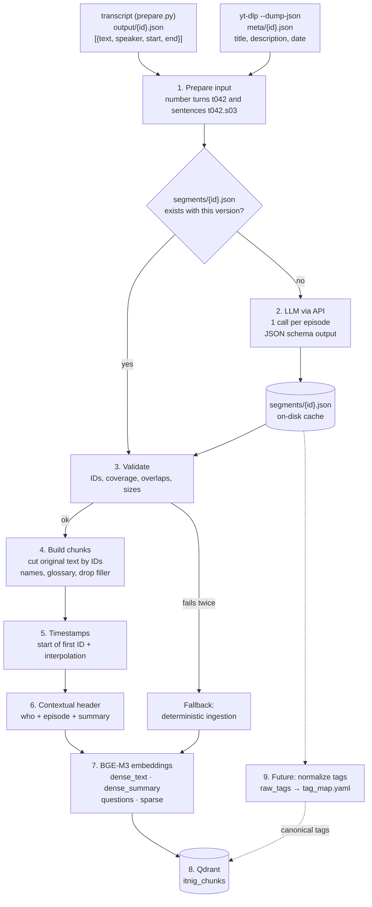

# LLM ingestion

How each episode becomes a set of retrievable chunks. An LLM reads the full episode once
and returns where to cut it (turn or sentence IDs only, never text), who each speaker
is, and metadata for each unit: type, summary, free topic tags and the questions it
answers. Chunks are always cut from the original transcript. If the LLM response fails
validation, that episode falls back to the deterministic pipeline
([deterministic-ingestion.md](deterministic-ingestion.md)).

## Status

| Step | | Status |
|---|---|---|
| 1 | Prepare the input | ✅ Implemented: `prepare.py`, `PrepareLLMInput` |
| 2 | Call the LLM | ✅ Implemented: `segment.py`, `SegmentEpisode` |
| 3 | Validate the response | ⏳ Planned (`SegmentEpisode` already accepts the retry feedback) |
| 4 | Build the chunks | ⏳ Planned |
| 5 | Timestamps | ⏳ Planned |
| 6 | Contextual header | ⏳ Planned |
| 7 | Embeddings | ⏳ Planned |
| 8 | Load into Qdrant | ⏳ Planned (`docker-compose.yml` runs Qdrant locally) |
| 9 | Normalize tags | 💡 Future, only when a feature needs it |

The rest of this document is the design, written before the implementation; the
planned steps may change as they get built.

**About the language.** The podcast, the transcripts and the people who will search
them are Spanish-speaking, so the *data* the LLM produces (titles, summaries, tags,
questions) is in Spanish. Spanish values below come with an English gloss.

## Diagram



## Steps

### 1. Prepare the input

- **Header:** the video's title, date and description, fetched with
  `yt-dlp --dump-json` (`meta/{id}.json`), because the transcript does not store them.
- **Numbering:** each turn gets an ID with its timestamp and speaker label:
  ```
  [t020 00:07:15 SPEAKER_01] Sí, sí, claro. Como digo, está fragmentado...
  ```
- **Long turns:** turns over 150 words are split into sentences (a sentence-end regex on
  `.`, `?`, `!`) with IDs `t020.s1`, `t020.s2`… so the LLM can cut inside a monologue
  like the 986-word one in the Wallbox episode.
  - **Why:** the LLM can only cut where there is an ID. If the smallest unit is the
    turn, a turn cannot be split. In the sample, only 10 % of the turns exceed 150 words
    (179 of 1,742), but they hold **46 % of the words**: almost half the content is
    monologue, and that is where guests tell their stories.
  - **What would be lost without sentence IDs:**
    - A monologue covering several topics would be embedded as a single vector. In
      Wallbox that would be renewables, vehicle-to-grid and consumption patterns: the
      vector averages the three and resembles none of them, so a query about any of
      them finds it less easily.
    - The 600-word cap per unit from step 3 could not be met.
    - Misattributed questions could not be separated, such as "¿Y cómo es la
      evolución?" (*"So how did it evolve?"*) inside Octavi's turn in the Nautal
      episode (`t020.s4`).
  - **Why 150 words:** short turns stay whole, because the topic rarely changes in
    under a minute. The input carries fewer IDs (fewer tokens, fewer ways to get it
    wrong) and the 46 % of the text that sits in monologues can still be cut.
  - **If the regex is wrong** (splitting "S.A." or "3.5", for example) there is no
    harm: it only adds a cut point the LLM will not use. Sentences are cut
    *candidates*, not cuts.
- **Size:** an episode takes between 12,000 and 22,000 input tokens, so it fits in a
  single call.

### 2. Call the LLM (once per episode)

- **Structured output with a JSON schema** (the provider's structured outputs).
  The design asked for temperature 0, but `claude-opus-5-5` rejects `temperature`, so
  determinism comes from the schema and the cache instead.
- **What the prompt asks for:**
  - `speakers`: the map `SPEAKER_XX → {name, role, company}`, inferred from the
    introductions, the title and the description.
  - `units`: contiguous `{from, to}` ID ranges that cover the whole episode without
    overlapping. Each unit tells one thing (an anecdote, a piece of advice, an
    explanation) and stands on its own.
  - For each unit:
    - `type`: `anecdota | consejo | opinion | dato | relleno` (anecdote, advice,
      opinion, fact, filler)
    - `title`
    - `summary` (1–2 sentences, with proper names)
    - `raw_tags` (0–4 free tags): the business problem the unit is about, such as
      `primeros clientes` (first customers), `pivote` (pivot) or `financiación`
      (fundraising). The prompt's rules:
      - Generic, reusable across any company and sector. Never a sector, product,
        company, person or place from the episode: for Nautal, `primeros clientes` ✓
        and `barcos` (boats) ✗; for Wallbox, `vehículo eléctrico` (electric vehicle) ✗.
        A technology is only valid when it is the topic itself and cuts across
        companies (`inteligencia artificial`).
      - In Spanish, lowercase, 1 to 3 words.
      - The plainest possible name: `primeros clientes`, not `early adopters`,
        `tracción inicial` or `go-to-market`.
      - Filler units get no tags.
    - `questions` (2–4 questions it answers, phrased the way a user would ask them)
  - `glossary`: fixes for mistranscribed names (`Autal → Nautal`,
    `Citrocket → Seedrocket`).
  - `episode_summary`: a 3–5 sentence summary of the episode.
- **Cache:** the response is stored in `segments/<id>.json` together with `model` and
  `prompt_version`. If it already exists with the same model and version, the LLM is
  not called again. Changing the prompt invalidates the cache explicitly. Tags are not
  part of the cache key: changing how they are normalized (step 9) does not require
  segmenting again.
- **Providers:** Anthropic (default) or OpenRouter, behind the `LLMProvider` port.

### 3. Validate the response

All checks are deterministic:

- Every ID exists and each `from` comes before its `to`.
- Full coverage: every turn or sentence belongs to exactly one unit.
- Each unit has between 80 and 600 words. `relleno` (filler) units are exempt.
- Every `SPEAKER_XX` label in the episode appears in `speakers`.

If anything fails, the call is retried once with the concrete errors appended to the
prompt. If it fails again, the episode goes through the deterministic pipeline and is
tagged `segmenter: "deterministic"` in the payload.

### 4. Build the chunks

- The **original text** is cut by the ID ranges. Text never comes from the LLM.
- `relleno` units are not indexed: greetings, jokes and ads. In the roundtable episode
  05, for example, the first minutes are about glasses.
- Two texts are produced per chunk:
  - `text_display`, with a name on each turn (`Octavi Uyà (Nautal): …`). This is what
    the answering LLM receives.
  - `text_embed`, without speaker labels and with the `glossary` applied. This is what
    gets embedded.
- Neighbouring units are linked with `prev_id` and `next_id`, to widen the context at
  query time (*small-to-big* retrieval).

### 5. Compute the timestamps

- `start` is the start of the first ID's turn. If that ID is a sentence (`t020.s4`), it
  is linearly interpolated by character position within the turn (~2.8 words/s;
  ±10–20 s error).
- `end` is the end of the last ID.
- The link is built as `&t=<start − 3>s`.

### 6. Add the contextual header

A header built from the step 2 output, with no extra calls, is prepended to the text
that gets embedded:

```
Octavi Uyà, fundador de Nautal (marketplace de alquiler de barcos), en
«Alquiler de barcos con Octavi Uyà de Nautal» (2020).
Para arrancar la oferta del marketplace, puso su propio velero como primer barco.
```

(*"Octavi Uyà, founder of Nautal (a boat rental marketplace), in 'Boat rental with
Octavi Uyà from Nautal' (2020). To kick-start the marketplace's supply, he listed his
own sailboat as the first boat."*)

This way the embedding "knows" who is speaking and what the fragment is about, even
when the text only says "yes, it was the first one, I moved it to another listing".

### 7. Compute the embeddings (several representations per unit)

All computed locally with BGE-M3:

| Vector (Qdrant) | What is embedded | What for |
|---|---|---|
| `dense_text` | header + `text_embed` | Matching the literal content |
| `dense_summary` | `summary` | Abstract queries ("first customers") vs. concrete text ("I listed my sailboat") |
| `questions` | each of the `questions` (multi-vector, `max_sim` comparator) | Question ↔ question similarity with the user's query |
| `sparse` | header + `text_embed` | Exact terms: company names, "tablón de anuncios", "freemium" |

Each episode also gets a point of its own with `type: "episode"` and
`episode_summary`, for broad queries and to diversify results across episodes.

### 8. Load into Qdrant

- **Collection:** `itnig_chunks`, with named vectors (`dense_text`, `dense_summary`,
  `questions` multi-vector and `sparse`).
- **Deterministic ID:** `uuid5(video_id + from_id)`. Re-ingesting overwrites instead of
  duplicating.
- **Payload:**

```json
{
  "video_id": "yOLw6ncCJwY",
  "episode_title": "Alquiler de barcos con Octavi Uyà de Nautal - Podcast 121",
  "episode_type": "entrevista",
  "published": "2020-01-07",
  "start": 453.8,
  "end": 525.9,
  "url": "https://www.youtube.com/watch?v=yOLw6ncCJwY&t=450s",
  "speakers": [
    {"label": "SPEAKER_01", "name": "Octavi Uyà", "role": "invitado", "company": "Nautal", "share": 0.86},
    {"label": "SPEAKER_02", "name": "Bernat Farrero", "role": "anfitrión", "company": "Itnig", "share": 0.14}
  ],
  "unit_type": "anecdota",
  "title": "El primer barco de la plataforma fue el suyo",
  "summary": "Para arrancar la oferta del marketplace, Octavi puso su propio velero en Nautal.",
  "raw_tags": ["primeros clientes", "marketplace"],
  "questions": ["¿Cómo consiguió Nautal sus primeros barcos?", "¿Cómo arrancar la oferta de un marketplace?"],
  "text_display": "Bernat Farrero (Itnig): ¿Y cómo es la evolución? ...\nOctavi Uyà (Nautal): Sí, sí, fue el primero...",
  "text_embed": "...",
  "prev_id": "…",
  "next_id": "…",
  "segmenter": "llm",
  "model": "…",
  "prompt_version": "seg-2"
}
```

The payload is a superset of the deterministic one: chunks that fall back live in the
same collection, with empty `unit_type`, `summary`, `raw_tags` and `questions`.

### 9. Future: normalize the tags

`raw_tags` are free and each episode is an independent call, so the same idea comes out
under different names depending on the episode (`primeros clientes`, `captación de los
primeros usuarios`…) and at uneven granularity (`financiación` vs. `ronda seed con
business angels`). For vector search this does not matter, because it searches by
meaning. For filtering it does: with five synonyms, the `primeros clientes` filter
misses the other four.

**Not needed for the first question → answer system.** It gets done when a concrete
feature asks for it:

- **Facets in the web app:** "Explore → First customers (43 experiences from 31
  founders)".
- **Corpus analysis:** what gets talked about, which topics have few experiences and
  which videos to ingest next.
- **Evaluation:** stratify the golden set by topic and measure recall per tag.

Doing it once the full corpus is segmented gives a map based on all the data, not on a
sample.

**Process:**

1. `normalize_tags.py` collects every `raw_tag` in `segments/*.json` with its
   frequency.
2. An LLM groups them, in a single call, into 20–30 canonical tags. For each one it
   gives the name, a one-line definition, what it excludes and the list of `raw_tags`
   it absorbs.
3. The result is written to `tag_map.yaml` and reviewed by hand.
4. At load time (step 8), `tags = [tag_map[t] for t in raw_tags]`, without an LLM.
   `raw_tags` stay in the payload for nuance.

**Design rules for the map:**

- **A single axis: the topic.** Sector, company and unit type are separate payload
  fields.
- **Granularity:** each canonical tag should cover between 2 % and 15 % of the units.
  Below that it is merged with another; above it, it is split.
- **A flat list**, or two levels at most.
- **Signal of a missing topic:** more than 10 % of the units having `raw_tags` with no
  match in the map.

Changing the taxonomy means editing `tag_map.yaml` and reloading Qdrant. The LLM is not
called again, neither per episode nor per unit.
